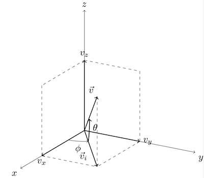

# Passage au mouvement 3D (x, y, z)


## États à définir

```javascript
let x = 0, y = 0, z = 0;
let vx = 0, vy = 0, vz = 0;
```

---

## Calcul de la vitesse totale

Formule :
$$
v = \sqrt{v_x^2 + v_y^2 + v_z^2}
$$

En JavaScript :

```javascript
const v = Math.sqrt(vx * vx + vy * vy + vz * vz);
```

---

## Orientation de la vitesse

- **Angle azimutal** $ \phi $ (dans le plan horizontal x-y) :
$$
\phi = \text{atan2}(v_y, v_x)
$$

- **Angle d'élévation** $ \theta $ (par rapport à l'horizontale) :
$$
\theta = \text{atan2}(v_z, \sqrt{v_x^2 + v_y^2})
$$

En JavaScript :

```javascript

	const phi = Math.atan2(vy, vx);    // Azimut (angle dans le plan x-y)
	const theta = Math.atan2(vz, Math.sqrt(vx * vx + vy * vy)); // Élévation
	
```

---

## Résumé général

| Élément | Formule |
|:---|:---|
| Vitesse totale $ v $ | $ \sqrt{v_x^2 + v_y^2 + v_z^2} $ |
| Angle azimutal $ \phi $ | $ \text{atan2}(v_y, v_x) $ |
| Angle d'élévation $ \theta $ | $ \text{atan2}(v_z, \sqrt{v_x^2 + v_y^2}) $ |

---

## Remarques :
- L'angle $ \phi $ est mesuré dans le plan horizontal (x, y).
- L'angle $ \theta $ indique si la trajectoire monte ou descend par rapport à l'horizontale.
- `atan2` gère correctement les quadrants (Nord, Sud, Est, Ouest).
