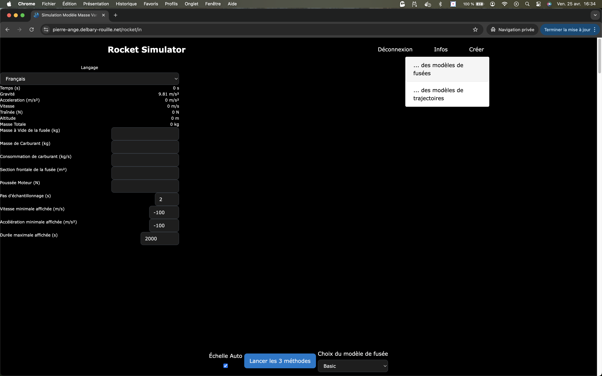
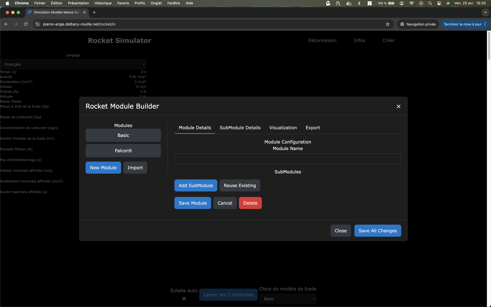
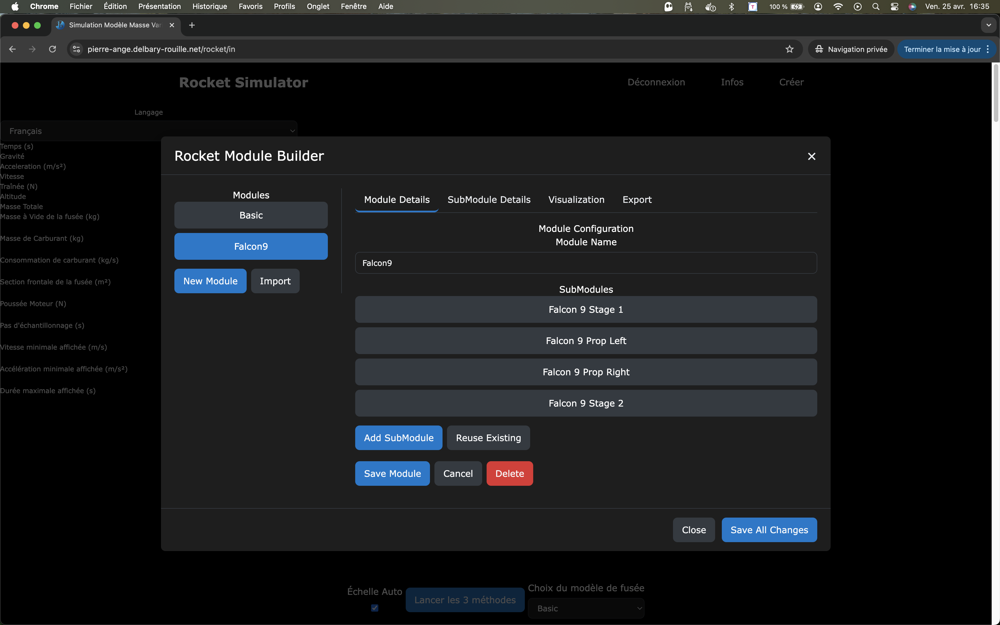
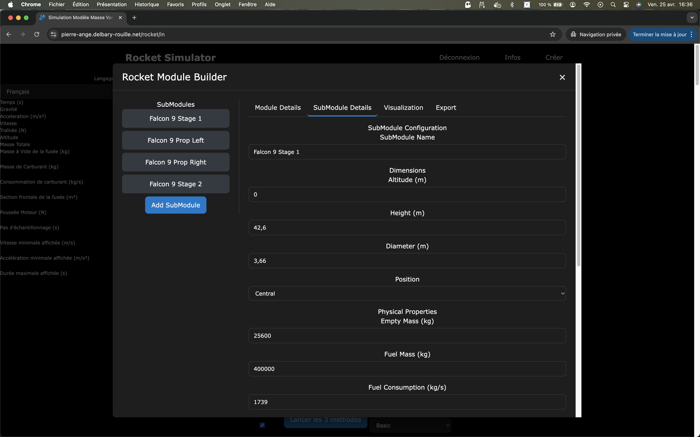
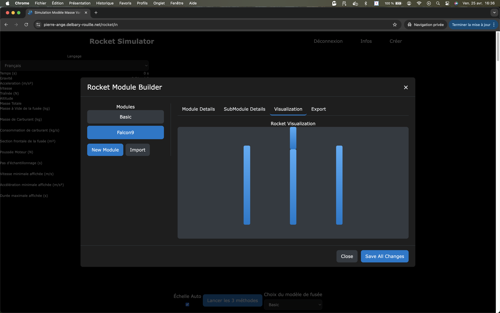

# Fenêtre de conception

---

## 🚀 Présentation rapide

Une fois identifié, le menu en haut à droite vous permet de : 

* Concevoir une fusée,
* Concevoir un script propre.

Sélectionnez alors **`"...des modèles de fusées"`**. L

La fenêtre de conception apparaît alors :

## 🚀 Concevoir une fusée

### Les Modules

La conception d'une fusée commence par la création d'un **`Module`**. Le module est le nom que l'on va donner à une fusée.

Un module est composé d'un ou plusieurs sous-modules (SubModules). Effectivement, une fusée est composée d'un ou plusieurs étages, et peut être accompagnée de sous-modules additionnels, par exemple des boosters.

Vous pouvez sélectionner un modèle éxistant en cliquant sur son nom, et alors s'affichera la liste de ses sous-modules : 

 

Notre application nous permet de définir plusieurs sous-modules pour une fusée qui auront chacuns leurs propres caractéristiques.

Pour ajouter un Module, cliquez sur le bouton **`"New Module"`**

Il vous faudra alors donner un nom à votre fusée !

### Les Sous-Modules

Une fois le module créé, vous pouvez aller sur l'onglet **`"SubModule Details"`** qui va vous permettre de définir les caractéristiques de chaque sous-module de la fusée.

Les caractéristiques sont :

* Le nom
* Ses dimensions
* Sa masse à vide
* Sa masse de carburant
* La consommation de carburant par seconde
* Sa section frontale (en mètres carrés)
* La poussée du moteur en Newtons
* Son coefficient de trainée
* Le temps au bout duquel le moteur démarre
* Le temps au bout duquel le moteur s'arrête
* La classe (à voir ultérieurement) qui sert à gérer le déplacement.

### La visualisation de la fusée

Vous pouvez visualiser l'allure de votre fusée en cliquant sur l'onglet **`"Visualization"`**

