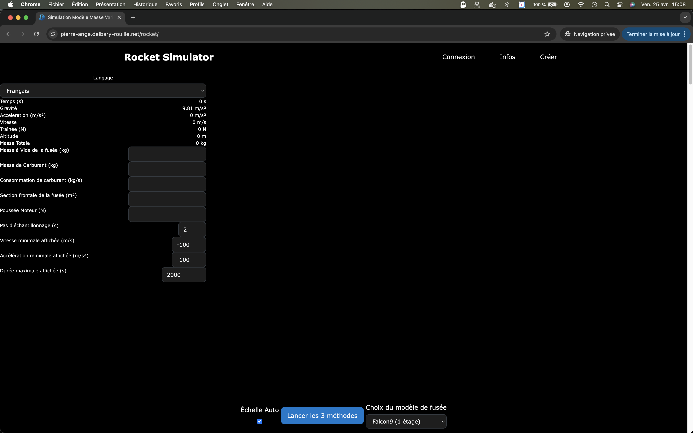
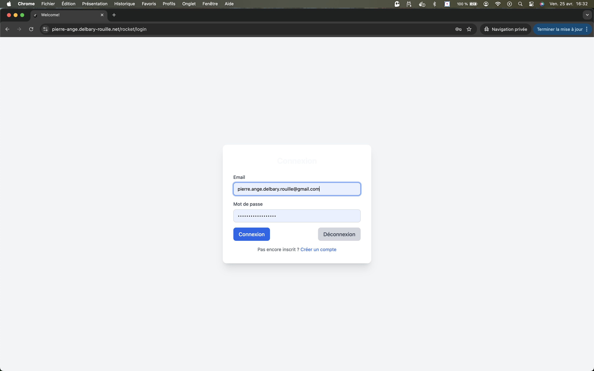
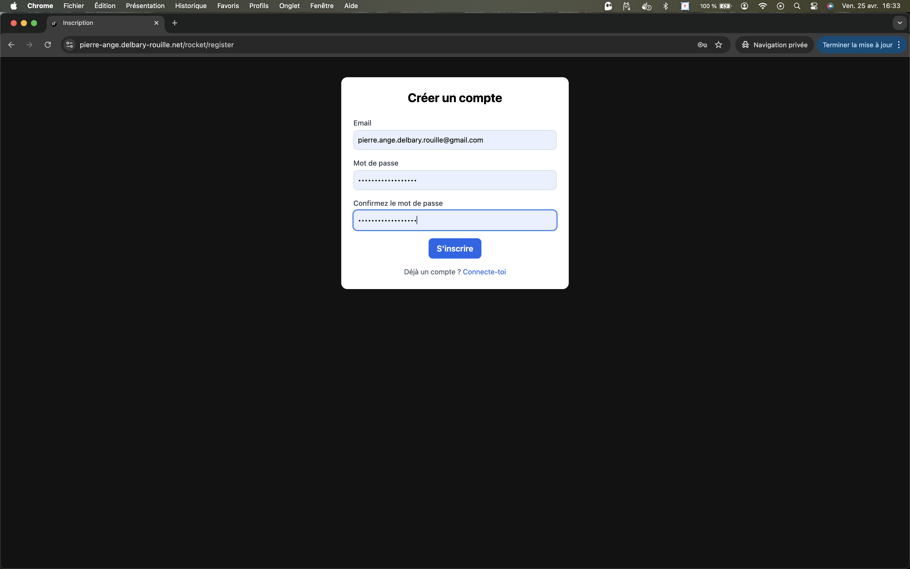

# Fenêtre d'identification

---

## 🚀 Présentation rapide

Sur la page principale vous pouvez développer vos propres modèles de fusées, voire utiliser des modèles partagés en vous connectant.

Pour ce faire, il faut aller dans le menu supérieur droit :

...et sur le choix "Connexion". La fenêtre d'identificaition apparaît alors :

Si vous avez déjà un compte, vous pouvez saisir vos identifiants, sinon, il faut cliquer sur le lien : **`"Créer un compte"`** qui vous amène sur une fenêtre d'enregistement : 

 