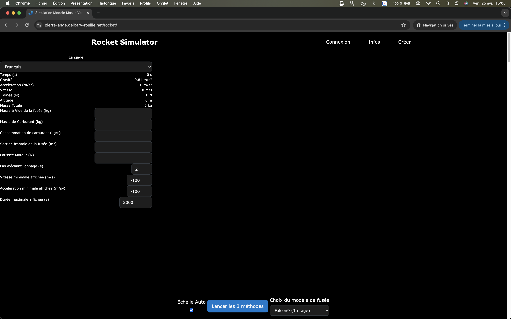

# Fenêtre principale

---

## 🚀 Présentation rapide

Vous arrivez sur la page principale qui est composée de 4 zones :

* Le menu en haut,
* La partie visualisation des données sur la gauche,
* La zone de visualisation de la trajectoire de la fusée à droite,
* Une zone pour lancer et sélectionner la fusée en dessous,
* Des graphiques tableaux représentant les données de la fusée au fil du temps tout en bas.

## Sélection d'un modèle de fusée

Vous pouvez sélectionner un modèle de fusée utilisant le sélecteur qui est par défaut sur `Basic`.

En mode non connecté, vous avez accès à deux fusées.

Vous pouvez lancer une fusée en appuyant sur le bouton **`Lancer les 3 méthodes`**

## Modification des indicateurs

Lors du lancement de la fuseé, vous pouvez sélectionner : 

* Le pas d'échantillonnage (commencer à 2 secondes puis réduire au fil du temps jusqu'à 0,01s)
* La Vitesse minimale affichée (m/s) (qui effacera toutes les vitesses en dessous de la valeur sur les graphiques en bas de page)
* L'Accélération minimale affichée (m/s²) (idem pour l'accélération)
* La Durée maximale affichée (s) (je vous conseille de la mettre à 20000, et d'ajuster par la suite).

## Les graphiques & tableaux

Une fois les 3 méthodes de calculs effectuées, les graphiques et tableaux se remplissent.

Ils vous permettent de visualiser : 

* L'altitude en fonction du temps
* La propulsion en fonction du temps
* La gravité en fonction du temps
* La masse du module en fonction du temps
* La vitesse en fonction du temps
* L'accélération en fonction du temps
* La traînée en fonction du temps (linéaire et logarithmique)
