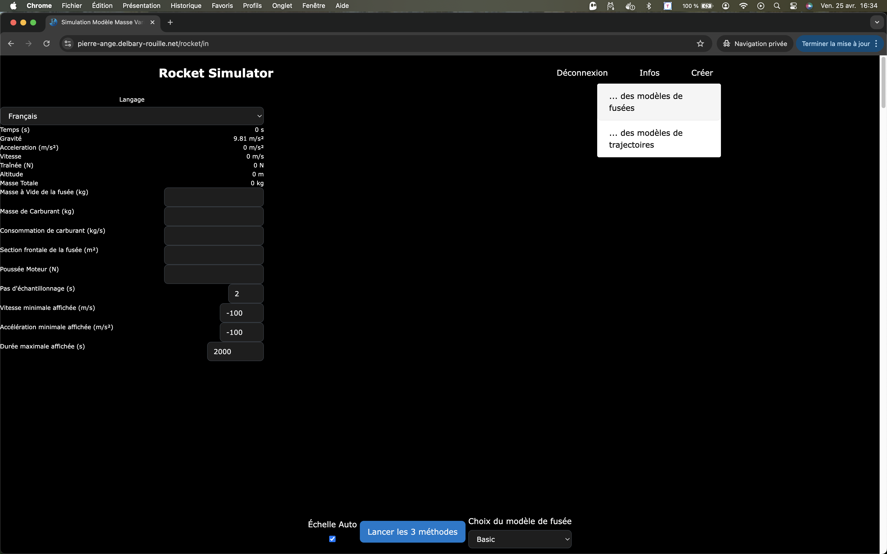
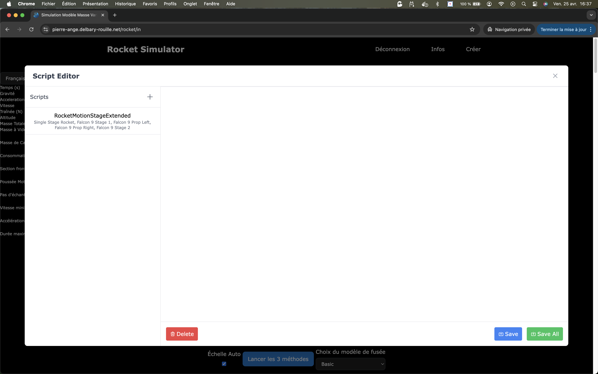
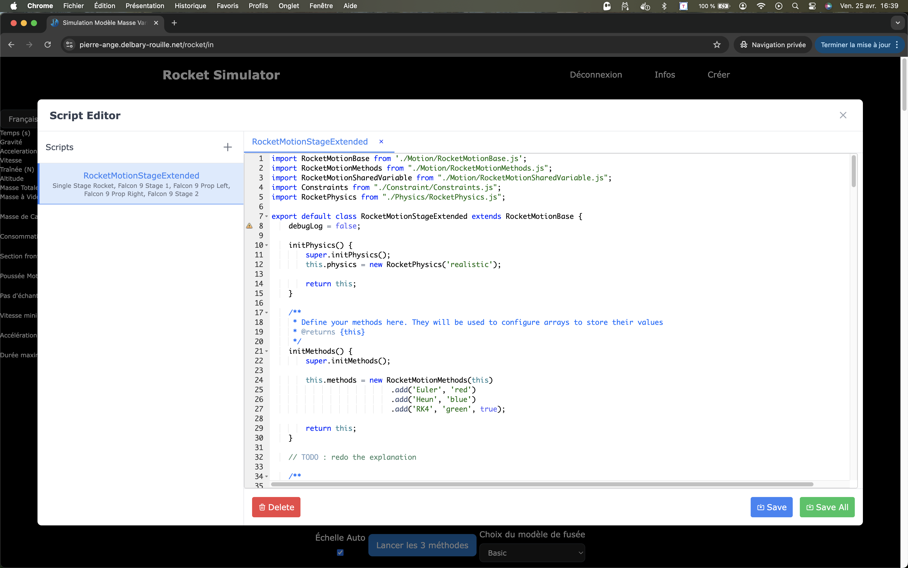
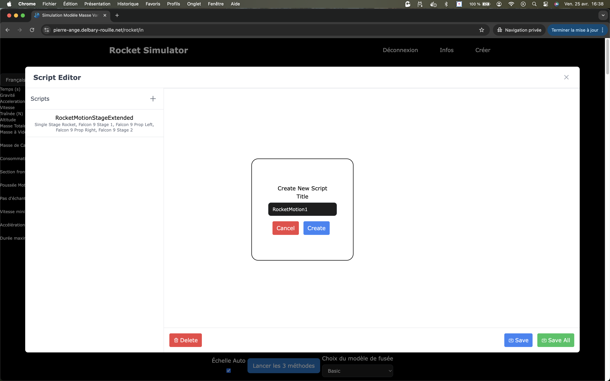

# Fenêtre de scripts

---

## 🚀 Présentation rapide

Une fois identifié, le menu en haut à droite vous permet de : 

* Concevoir une fusée,
* Concevoir un script propre.

Sélectionnez alors **`"...des modèles de trajectoires"`**. 

La fenêtre de conception de scripts de trajectoire apparaît alors :

## 🚀 Concevoir une trajectoire

### La base

A la base, toutes les fusées ont un modèle de trajectoire "hérité" d'une classe **`"RocketMotionStageExtended"`**

Cette classe est livrée avec notre **`JavaScript`**, mais elle peut être étendue selon vos désirs et surtout compétences.

Effectivement, il pourrait être utile de doter la fuseé de nouveaux paramètres de trajectoire. C'est ce que concepteur de scripts vous permet de faire.

La barre lattérale vous indique les scripts existants, et si vous en sélectionnez un, vous pouvez en observer le contenu : 

### Concevoir un nouveau script

Pour ajouter un nouveau script, il suffit de cliquer sur le **`+`** dans la barre lattérale.

Une fenêtre s'ouvre alors vous proposant de donner un nom à votre script :

Une fois votre nom saisi, vous avez accès à la fenêtre de saisie dans laquelle vous pourrez entrer les paramètres de votre classe :

### Documentation sur les classes

La documentation reste à compléter.